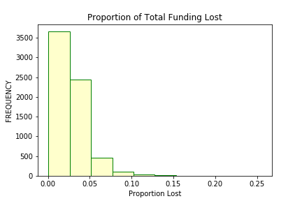
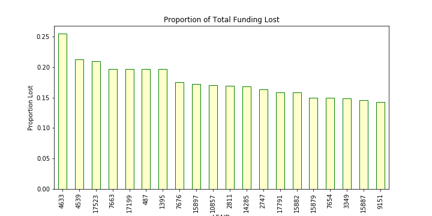
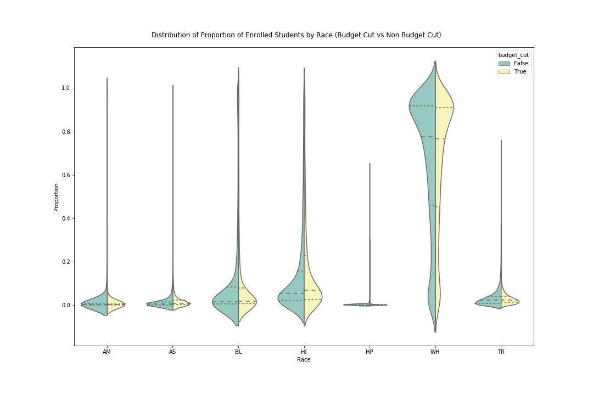
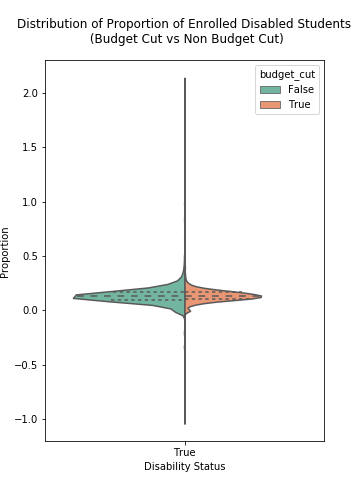

## HW 4

## Solution 1

### Rank and visualize Federal Funding by States

###### Figure 1: Proportion of Total Funding Lost

###### Figure 2: 20 Districts affected most by budget cut 

## Solution 2

###### Figure 4: 25 Districts affected most by budget cut

## Solution 3

###### Figure 5: 25 Districts affected most by budget cut

## Solution 4

For this problem, I chose to critique Tian Sang's HW3.  Link for the assignment : https://github.com/stiangithub/HW3

The method Tian suggested is very simple to understand and easy to implement - to cut 15% of the budget for each school district. Tian reasoned it would be not fair to cut the same amount from each school district which makes sense as the budget for schools are different and that might lead to creating a big deficit for schools with a small budget and hurt them in the long run as compared to other schools.

In my opinion there are certain important factors which Tian missed out on - cutting equal proportion from each district might result into increase debt for certain schools which have higher debt than the funding they were receiving which in turn will make them less competitive and give other schools an unfair edge over them. Therefore, the debt school has on their account should also be considered as it might hurt schools with high debt to cut 15% from their existing budget. 

Other factors that could be taken into account are the performance of schools as well as demographics of school to make sure the budget cut is completely from those schools where it'll not hurt the performance of the students so that they can get access to quality education by making sure schools with high debt receive enough funding so that they can sustain and remain competitive.

## Solution 5

For this problem, I would like to comment on Visualization Lecture. 

While I believe every lecture was informative, I found visualization one very useful as it explained why a powerful visualization is equally important skill set to have for a Data Scientist than any other skill. 

I believe often while focusing more on Data Processing and Modeling part, we miss out on creating impactful visualization by missing out on simple but subtle techniques. The lecture covered many things that makes a good visualization which we fail to notice as we are more focused on other aspects of the problem. It was refreshing to understand that everything is important in visualization, from choosing the type of visualization, the color scheme used for better interpretability, the size of plots and selection of shape and size of data points. I certainly believe it'll be very helpful in future as now we'll pay more attention to details of visualization and make our method as well as results more interpretable.
